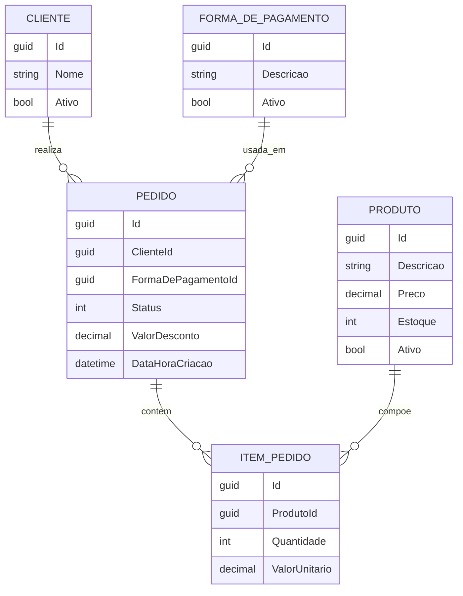

# MeusPedidos

Projeto de estudo desenvolvido para praticar a construção de uma API de pedidos com .NET, utilizando uma arquitetura simples em camadas e aplicando regras de domínio nas principais entidades do sistema.

A ideia do projeto é evoluir a aplicação de forma incremental: começando pela modelagem do domínio, passando pelos endpoints e persistência de dados, até chegar ao fluxo completo de criação, pagamento e cancelamento de pedidos.

## O que o projeto faz

A API permite trabalhar com os principais dados de um fluxo de pedidos:

- Cadastro e consulta de clientes
- Cadastro e consulta de produtos
- Cadastro e consulta de formas de pagamento
- Criação e listagem de pedidos
- Consulta de pedido por ID
- Pagamento de pedido
- Cancelamento de pedido

O projeto não possui interface gráfica. O foco está totalmente no backend, na organização do domínio e na prática de boas decisões de arquitetura e modelagem.

## Tecnologias utilizadas

- .NET 10
- ASP.NET Core Web API
- Entity Framework Core
- PostgreSQL
- Swagger
- xUnit
- FluentAssertions
- Moq

## Estrutura do projeto

```text
src/
  MeusPedidos.API/              Controllers, configuração da API e Swagger
  MeusPedidos.Application/      Casos de uso da aplicação
  MeusPedidos.Domain/           Entidades, enums, interfaces e exceções de domínio
  MeusPedidos.Infrastructure/   DbContext, migrations e repositories

tests/
  MeusPedidos.Tests/            Testes unitários do domínio

docs/
  modelagem-api-pedidos-v1.pdf  Documento inicial de modelagem
```

## Camadas

O projeto segue uma separação simples de responsabilidades:

- **API**: recebe as requisições HTTP e direciona os fluxos da aplicação.
- **Application**: concentra os casos de uso, como criação, pagamento e cancelamento de pedidos.
- **Domain**: contém as entidades, regras de negócio e validações do sistema.
- **Infrastructure**: responsável pela persistência de dados utilizando Entity Framework Core e PostgreSQL.

### Observação sobre casos de uso e repositories

Os casos de uso foram aplicados principalmente ao agregado `Pedido`, já que ele concentra as regras mais importantes do domínio, como cálculo de valores, pagamento, cancelamento e manipulação de itens.

Já os controllers de `Cliente`, `Produto` e `FormaDePagamento` utilizam repositories diretamente de forma proposital, mantendo o projeto mais simples nesta etapa de estudo.

A intenção é evoluir esses fluxos futuramente conforme novas regras de negócio surgirem e o projeto amadurecer.

## Modelagem do domínio

A modelagem inicial está documentada em [`docs/modelagem-api-pedidos-v1.pdf`](docs/modelagem-api-pedidos-v1.pdf).

As principais entidades são:

- **Cliente**: representa quem realiza o pedido.
- **Produto**: representa os itens disponíveis para venda.
- **FormaDePagamento**: representa a forma utilizada para pagamento.
- **Pedido**: representa a compra realizada por um cliente.
- **ItemPedido**: representa cada item presente em um pedido.

### Relacionamentos

- Um **Cliente** pode possuir vários **Pedidos**.
- Um **Pedido** possui vários **ItensPedido**.
- Um **Produto** pode estar presente em vários **ItensPedido**.
- Uma **FormaDePagamento** pode ser utilizada em vários **Pedidos**.



## Diagrama de casos de uso


## Regras de negócio

Algumas regras já aplicadas no domínio:

- Cliente deve possuir nome obrigatório.
- Produto deve possuir descrição válida, preço maior que zero e estoque não negativo.
- Pedido deve possuir cliente válido.
- Pedido deve possuir forma de pagamento válida.
- Pedido deve conter pelo menos um item.
- Item do pedido deve possuir quantidade maior que zero.
- Item do pedido deve possuir valor unitário maior que zero.
- O total do pedido é calculado com base nos itens.
- O desconto não pode ser negativo nem maior que o total dos produtos.
- Pedidos pagos ou cancelados não podem ser alterados.
- Um pedido cancelado não pode ser cancelado novamente.

## Endpoints principais

### Clientes

- `POST /api/Cliente`
- `GET /api/Cliente/{id}`
- `PUT /api/Cliente/{id}`

### Produtos

- `POST /api/Produto`
- `GET /api/Produto/{id}`
- `PUT /api/Produto/{id}`

### Formas de pagamento

- `POST /api/FormaDePagamento`
- `GET /api/FormaDePagamento/{id}`
- `PUT /api/FormaDePagamento/{id}`

### Pedidos

- `POST /api/Pedidos`
- `GET /api/Pedidos`
- `GET /api/Pedidos/{id}`
- `POST /api/Pedidos/{id}/pagar`
- `POST /api/Pedidos/{id}/cancelar`

## Como executar

Configure a string de conexão do PostgreSQL em:

```text
src/MeusPedidos.API/appsettings.json
```

Exemplo utilizado no projeto:

```json
"DefaultConnection": "Host=localhost;Port=5432;Database=MeusPedidos;Username=postgres;Password=1234;"
```

Depois, execute os comandos:

```bash
dotnet restore
dotnet ef database update --project src/MeusPedidos.Infrastructure --startup-project src/MeusPedidos.API
dotnet run --project src/MeusPedidos.API
```

Com a API em execução, o Swagger estará disponível em:

```text
http://localhost:<porta>/swagger
```

## Testes

Para executar os testes automatizados:

```bash
dotnet test
```

Atualmente, os testes cobrem principalmente regras da entidade `Pedido`, seguindo o padrão Arrange, Act e Assert.

## Observação

Este é um projeto de estudo voltado para prática de arquitetura, modelagem de domínio, persistência com Entity Framework Core, PostgreSQL e testes unitários em aplicações .NET.