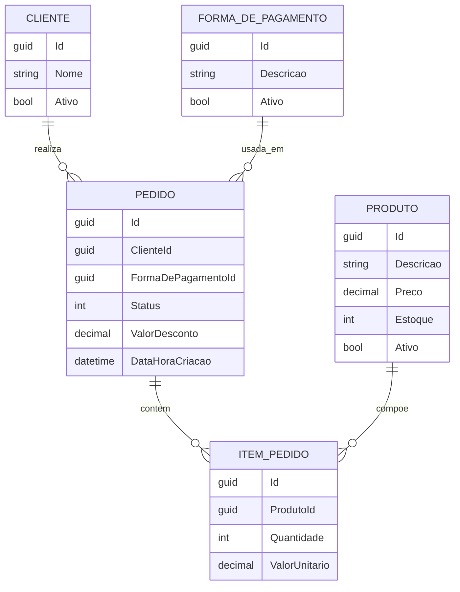
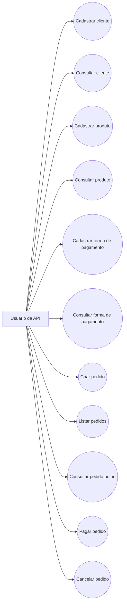

# MeusPedidos

Projeto de estudo para desenvolvimento de uma API de pedidos com .NET, usando uma estrutura simples em camadas e regras de dominio aplicadas nas entidades principais.

O objetivo e construir a API de forma incremental: primeiro a modelagem do dominio, depois os endpoints, persistencia com banco de dados e, por fim, o fluxo de criacao, pagamento e cancelamento de pedidos.

## O que o projeto faz

A API permite trabalhar com os principais dados de um fluxo de pedidos:

- Cadastro e consulta de clientes
- Cadastro e consulta de produtos
- Cadastro e consulta de formas de pagamento
- Criacao e listagem de pedidos
- Consulta de pedido por id
- Pagamento de pedido
- Cancelamento de pedido

Este projeto nao possui interface grafica. O foco e o backend, a organizacao do dominio e a pratica de boas decisoes de arquitetura.

## Tecnologias utilizadas

- .NET 10
- ASP.NET Core Web API
- Entity Framework Core
- PostgreSQL
- Swagger
- xUnit
- FluentAssertions
- Moq

## Estrutura do projeto

```text
src/
  MeusPedidos.API/              Controllers, configuracao da API e Swagger
  MeusPedidos.Application/      Casos de uso da aplicacao
  MeusPedidos.Domain/           Entidades, enums, interfaces e excecoes de dominio
  MeusPedidos.Infrastructure/   DbContext, migrations e repositories

tests/
  MeusPedidos.Tests/            Testes unitarios do dominio

docs/
  modelagem-api-pedidos-v1.pdf  Documento de modelagem inicial
```

## Camadas

O projeto segue uma separacao simples de responsabilidades:

- **API**: recebe as requisicoes HTTP e chama os casos de uso ou repositories.
- **Application**: concentra os fluxos da aplicacao, como criar, listar, pagar e cancelar pedidos.
- **Domain**: contem as regras principais do negocio, entidades e validacoes.
- **Infrastructure**: cuida da persistencia com Entity Framework Core e PostgreSQL.

### Observacao sobre casos de uso e repositories

Neste projeto, os casos de uso foram aplicados principalmente ao agregado `Pedido`,
pois ele concentra as regras de negocio mais importantes do dominio: criacao,
pagamento, cancelamento, itens e calculo de valores.

Os controllers de `Cliente`, `Produto` e `FormaDePagamento` ainda utilizam
repositories diretamente de forma proposital, para manter o projeto simples nesta
etapa de estudo. A intencao e evoluir esses fluxos futuramente para casos de uso
proprios, conforme novas regras de negocio forem surgindo.

Essa decisao foi tomada para dar enfase ao agregado principal da aplicacao sem
adicionar complexidade desnecessaria aos cadastros mais simples.

## Modelagem do dominio

A modelagem inicial esta documentada em [`docs/modelagem-api-pedidos-v1.pdf`](docs/modelagem-api-pedidos-v1.pdf).

As entidades principais sao:

- **Cliente**: representa quem faz o pedido.
- **Produto**: representa os itens disponiveis para venda.
- **FormaDePagamento**: representa a forma usada para pagar o pedido.
- **Pedido**: representa a compra feita por um cliente.
- **ItemPedido**: representa cada produto dentro de um pedido.

### Relacionamentos

- Um **Cliente** pode ter varios **Pedidos**.
- Um **Pedido** possui varios **ItensPedido**.
- Um **Produto** pode aparecer em varios **ItensPedido**.
- Uma **FormaDePagamento** pode ser usada em varios **Pedidos**.



## Diagrama de casos de uso



## Regras de negocio

Algumas regras ja aplicadas no dominio:

- Cliente deve ter nome obrigatorio.
- Produto deve ter descricao, preco maior que zero e estoque nao negativo.
- Pedido deve ter cliente valido.
- Pedido deve ter forma de pagamento valida.
- Pedido deve conter pelo menos um item.
- Item do pedido deve ter quantidade maior que zero.
- Item do pedido deve ter valor unitario maior que zero.
- O total do pedido e calculado a partir dos itens.
- Desconto nao pode ser negativo nem maior que o total dos produtos.
- Pedido pago ou cancelado nao pode ser alterado.
- Pedido ja cancelado nao pode ser cancelado novamente.

## Endpoints principais

### Clientes

- `POST /api/Cliente`
- `GET /api/Cliente/{id}`
- `PUT /api/Cliente/{id}`

### Produtos

- `POST /api/Produto`
- `GET /api/Produto/{id}`
- `PUT /api/Produto/{id}`

### Formas de pagamento

- `POST /api/FormaDePagamento`
- `GET /api/FormaDePagamento/{id}`
- `PUT /api/FormaDePagamento/{id}`

### Pedidos

- `POST /api/Pedidos`
- `GET /api/Pedidos`
- `GET /api/Pedidos/{id}`
- `POST /api/Pedidos/{id}/pagar`
- `POST /api/Pedidos/{id}/cancelar`

## Como executar

Configure a string de conexao com o PostgreSQL em:

```text
src/MeusPedidos.API/appsettings.json
```

Exemplo usado no projeto:

```json
"DefaultConnection": "Host=localhost;Port=5432;Database=MeusPedidos;Username=postgres;Password=1234;"
```

Depois, execute os comandos:

```bash
dotnet restore
dotnet ef database update --project src/MeusPedidos.Infrastructure --startup-project src/MeusPedidos.API
dotnet run --project src/MeusPedidos.API
```

Com a API em execucao, acesse o Swagger em:

```text
http://localhost:<porta>/swagger
```

## Testes

Para executar os testes:

```bash
dotnet test
```

Os testes atuais cobrem regras basicas da entidade `Pedido`, seguindo a ideia de Arrange, Act e Assert.

## Observacao

Este e um projeto de estudo. A ideia principal e praticar modelagem, organizacao em camadas, persistencia com EF Core, regras de negocio e testes unitarios basicos.
